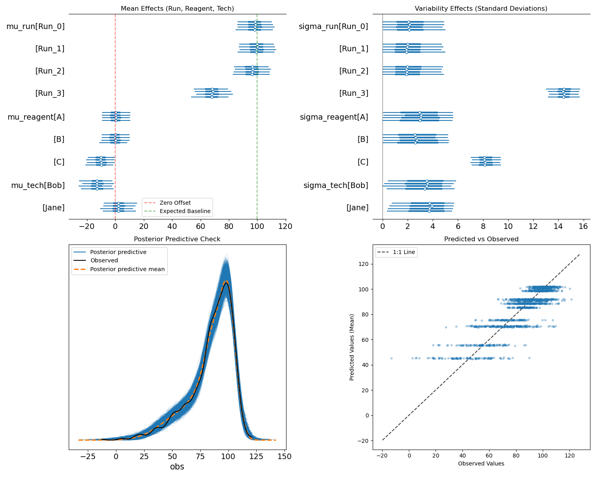

# Bayesian Modeling of a High-Throughput Lab Assay
 
Bayesian modeling is a great way to describe what is being observed in data. Something that we all
think we might be able to do at various levels of success; however, in practice, often there is just
too much data or it is too complex to be easily interpreted manually. Fitting a simple Bayesian
model and visualizing it can quickly identify and convey what is going on with your data. 

This article is an example of identifying outliers in plate-based analytical assays. For example,
a 96-well plate with reactions that use different lots of reagents and are run by different
technicians at different times on the same instrument. Sometimes assay runs don't work as well as
they should and it'd be helpful to have better clarity about why. 

The excellent "[Statistical Rethinking](https://github.com/dustinstansbury/statistical-rethinking-2023)"
book and recorded lectures inspired this write-up. I've worked with many labs and with many
different assays. This approach is one of my current favorites for helping to QC and keep an assay
running well.

## Example: Plate Assay Outlier Detection

Imagine a plate-based analytical assay that is run several times a day and has different lots for a
reagent (say A, B or C) and is run by different technicians (say Jane and Bob). What reagent lots
are better or worse? What technicians are better or worse? 

Below are the high level steps of some Python code that fits data to a Bayesian model and displays
the results. See [plate_modeling.py](plate_modeling.py) for the full code -- later parts of this
page will cover each method below.

```python
def run_example():
   # Make this example deterministic
   np.random.seed(42)

   # 1. Load an export of data from several experiments.
   df = load_data()

   # 2. Fit a Bayesian model to the data.
   trace = model_data(df)

   # 3. Print out the fitted model and save/show a plot of the fitted model.
   print_model_and_make_plot(trace)
```

The above code splits things up to three steps. Each will be covered below.

## Loading Data

A normal lab would have some way to collect real data and export it for analysis. No matter what the
data is, it'll typically end up in a tabular form with a row per result and many columns. One column
will be whatever the assay measures. The other columns will be meta-data about how the assay was run,
such as reagents used and who/tech that did the work.

The `load_data()` method returns a DataFrame of such tabular data. Instead of loading a real CSV
exported from a LIMS, it makes up similar data.

```python
def load_data():
    """Create fake data that represents several runs of a 96-well plate assay.

    Normally, this would be exported from a LIMS or similar. For the sake of the example, a fake
    data set is created. This data is made with known effects that will hopefully be learned by the
    model. e.g. telling us what runs, tech(s) and reagent(s) are abnormal.
    """
    # Each assay run consists of four 96-well plates. Each plate is prepared by one tech using one
    # set of reagents; however, the four plates in an run may be any combo of techs and reagents.
    plates_per_run = 4
    wells_per_plate = 96

    # Run 0, 1 and 2 all are pretty good. 100 is our made-up, expected result.
    # Run 3 is substantially worse (lower mean, higher noise). We'll assume instrument issues.
    run_mu = {'Run_0': 100, 'Run_1': 102, 'Run_2': 98, 'Run_3': 70}
    run_sigma = {'Run_0': 5, 'Run_1': 5, 'Run_2': 5, 'Run_3': 15}
    runs = run_mu.keys()

    # Reagent lots A and B are good. No abnormal effect on the assay.
    # Reagent lot C has a negative bias and adds more noise.
    reagent_mu_effect = {'A': 0, 'B': 0, 'C': -10}
    reagent_sigma_effect = {'A': 1, 'B': 1, 'C': 8}
    reagents = list(reagent_mu_effect.keys())

    # Jane is the senior tech and runs the assay without any negative effect.
    # Bob is still learning. Whatever he is doing, it has negative bias and adds noise.
    tech_mu_effect = {'Jane': 0, 'Bob': -15}
    tech_sigma_effect = {'Jane': 1, 'Bob': 2}
    technicians = list(tech_mu_effect.keys())

    # Make all the plates for each run. Randomly picking reagent lots and techs.
    data = []
    for run in runs:
        for p_idx in range(plates_per_run):
            reagent = np.random.choice(reagents)
            tech = np.random.choice(technicians)

            # Combine means and variances (sum of variances for independent sources)
            total_mean = run_mu[run] + reagent_mu_effect[reagent] + tech_mu_effect[tech]
            total_sigma = np.sqrt(run_sigma[run]**2 + reagent_sigma_effect[reagent]**2 + tech_sigma_effect[tech]**2)

            plate_results = np.random.normal(total_mean, total_sigma, wells_per_plate)

            for well_val in plate_results:
                data.append({
                    'run': run,
                    'reagent': reagent,
                    'technician': tech,
                    # The value is whatever the assay measured. Assume 100 means a good result for a
                    # control, and we're measuring plates full of control samples.
                    'value': well_val
                })

    return pd.DataFrame(data)
```

In practice, all of the above would likely be a one-line import of a CSV file or similar. A
convenient thing about making fake data is that we can purposely modify it to so that we know things
about it and we can see if the model finds them.

There are three things we're hoping to see:

1. Run_3 is a bad one. Unrelated to any reagent or tech.
2. Reagent lot "C" is bad. It negatively impacts assays that used it.
3. Bob isn't great at running this assay. Jane should help train him more.

Any of the above can be changed, if you want to re-run the model and see how it does. For example,
add in more technicians, reagents or runs. Make any of them subtly worse or better than others.

## Modeling

The model ends up being similar to make as the fake data generation. This is because in both cases
we know what columns are expected in the data. The model knows that each assay run makes some value
and was run by a tech using a reagent lot. The model doesn't know anything about the three
interesting things (noted in the "Loading Data" section) that effect the runs.

The model treats the assay value as a combination of three independent effects: run, tech and reagent. 
Crucially, the model is structured with a **baseline** and **offsets**:
* **mu_run** is the absolute baseline for each run (centered at the expected value of 100).
* **mu_reagent** and **mu_tech** are relative offsets (centered at 0) that represent how much a specific lot or person deviates from that baseline.

The total noise (sigma) is modeled as the square root of the sum of individual variances.
This assumes that the sources of variability (run, reagent and tech) are independent of one another.

```python
def model_data(df):
    """Create a Bayesian model that will fit the assay data.

    This model doesn't know anything about the effects that load_data() used. All the model knows
    about are the columns of our data set: runs, reagents and techs. These three things are assumed
    to be normal distributions that will be fit to best match the observed data.
    """
    runs = sorted(df['run'].unique())
    reagents = sorted(df['reagent'].unique())
    technicians = sorted(df['technician'].unique())

    # 2. Bayesian Modeling
    with pm.Model(coords={"run": runs, "reagent": reagents, "tech": technicians}) as model:
        # Indices
        run_idx = pd.Categorical(df['run'], categories=runs).codes
        reagent_idx = pd.Categorical(df['reagent'], categories=reagents).codes
        tech_idx = pd.Categorical(df['technician'], categories=technicians).codes

        # Priors for Run effects (Absolute)
        # Run mu starts at 100 since that is the expected output of a good assay
        mu_run = pm.Normal('mu_run', mu=100, sigma=20, dims="run")
        sigma_run = pm.Exponential('sigma_run', lam=0.1, dims="run")

        # Priors for Reagent effects (Offsets)
        # Reagent: mu starts at 0 because we assume that all reagent lots are good.
        mu_reagent = pm.Normal('mu_reagent', mu=0, sigma=10, dims="reagent")
        sigma_reagent = pm.Exponential('sigma_reagent', lam=0.1, dims="reagent")

        # Priors for Technician effects (Offsets)
        # Tech mu starts at 0 because we assume all trained techs will run the assay correctly.
        mu_tech = pm.Normal('mu_tech', mu=0, sigma=10, dims="tech")
        sigma_tech = pm.Exponential('sigma_tech', lam=0.1, dims="tech")

        # Expected value and noise
        mu = mu_run[run_idx] + mu_reagent[reagent_idx] + mu_tech[tech_idx]

        # Combine noise components (Sum of variances)
        var_total = (sigma_run[run_idx]**2 +
                     sigma_reagent[reagent_idx]**2 +
                     sigma_tech[tech_idx]**2)
        sigma = pm.Deterministic('sigma', pm.math.sqrt(var_total))

        obs = pm.Normal('obs', mu=mu, sigma=sigma, observed=df['value'])

        # Sampling
        return pm.sample(1000, tune=1000, target_accept=0.9, return_inferencedata=True)
```

## Results

The models results are printed as output along with a visualization of the same information. It is
interesting to look first at the visualization. It is clear that all of the effects that were
purposely added to the fake data were found.

Vertical lines are added to help show both the expected baseline value of 100 for a run, and that
zero is the expected impact from tech and reagent. Notice the following.

* Run `Run_3` is clearly worse compared to the other runs. This is also independent of tech and reagent.
* Reagent `C` seems like a bad lot. It has a negative impact on the assay and should be replaced.
* Technician `Bob` has a similarly negative impact on the assay. He should likely get more training.

All of the above are unsurprising given that we know how the fake data was generated; however,
the model identified these issues without knowing anything about how the data was generated. If this
was real data, these would all be interesting findings for improving the assay.




The fitted model results are also printed as the following.

```python
Model Summary:
mean     sd  hdi_3%  ...  ess_bulk  ess_tail  r_hat
mu_run[Run_0]  98.014  6.837  84.677  ...    1194.0    1434.0    1.0
mu_run[Run_1]  99.277  6.843  86.128  ...    1196.0    1396.0    1.0
mu_run[Run_2]  95.974  6.843  83.201  ...    1206.0    1447.0    1.0
mu_run[Run_3]  67.767  6.874  54.667  ...    1201.0    1453.0    1.0
mu_reagent[A]   0.168  5.211  -9.153  ...    1400.0    1860.0    1.0
mu_reagent[B]  -0.239  5.208  -9.905  ...    1374.0    1792.0    1.0
mu_reagent[C] -10.171  5.207 -19.271  ...    1379.0    1791.0    1.0
mu_tech[Bob]  -12.415  5.882 -22.942  ...    1544.0    1673.0    1.0
mu_tech[Jane]   2.749  5.868  -7.639  ...    1556.0    1732.0    1.0
```

You can run the above example with a copy of the `plate_modeling.py` script and the conda
environment described by `setup.md`. Then run `conda run -n bayesian_example python plate_modeling.py`

