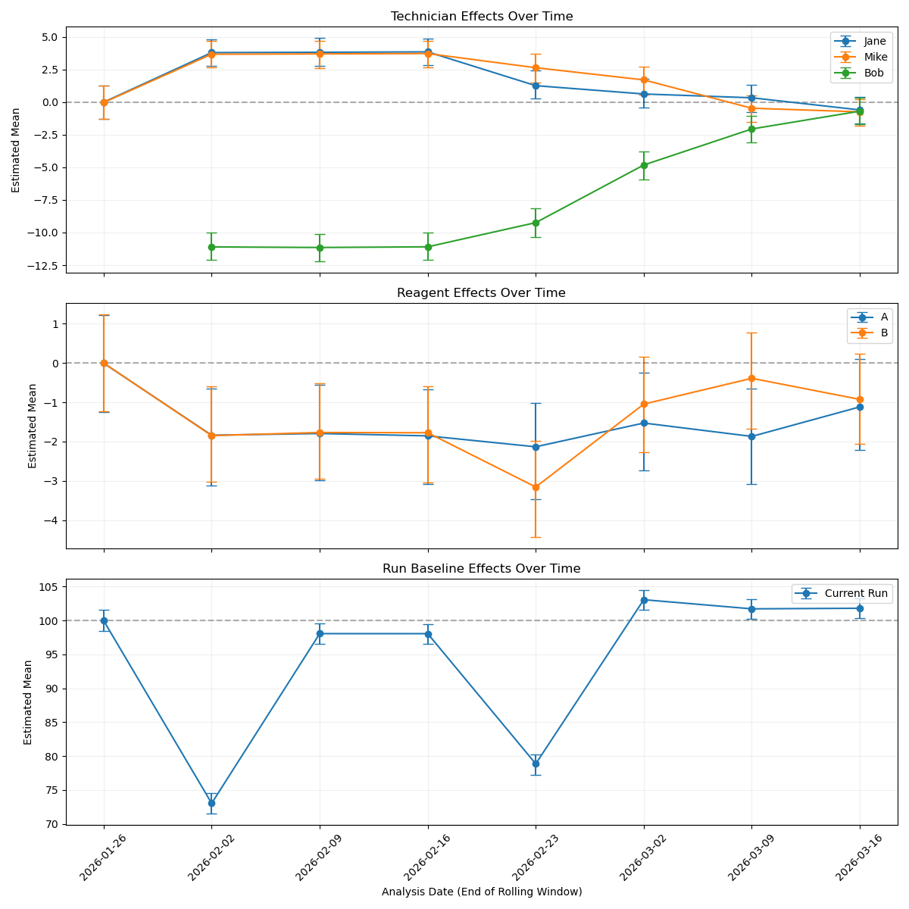

# Control Charting with Bayesian Modeling

This is an extension of the [Bayesian Modeling of a Lab Assay](../bayesian/README.md). The example here extends use of the
code to show trends over time. This is particularly helpful when the same assay is being run
repetitively, say several times per week or month. For example, a biomanufacturing company or a
lab diagnostic testing company may try to keep each instrument running 24/7, generating at least a
run per day. 

Let's say that something interesting happens over time. Consider these examples:

1. Bob joined the existing team of Jane and Mike. Results were worse in the first month when Bob
   ran the assay; however, by Bob's second month he is as good as the rest of the team.
2. The instrument clogs over time. Normal maintenance fixes it; however, annoyingly around
   1 out of 10 runs has issues.

Both of the above are happening at the same time, which makes it tricky to quickly spot the root
cause of an issue. For example, Bob's impact on the assay might be confused with the known, sporadic
instrument issues. Modeling can help make it Instead obvious that the instruments still act up, and
that Bob needs help until he improved in the second month.

### Making Fake Data
Below shows example data that we'll create. Assume one run of 8 plates is done each week. There are
11 runs of data generated below. Three weeks before Bob joins then two months with Bob.
See [weekly_charting.py](weekly_charting.py) and the `load_data()` method for the full code.

```csv
date,reagent,technician,value
2026-01-05,B,Jane,97.51376047321659
2026-01-05,B,Jane,100.71308696313865
2026-01-05,B,Jane,100.62395529788888
...
```

### Modeling
The model for these runs captures run (a proxy for time), tech, and reagent. The trick
here is that we'll use a rolling window to show trends over time. In this case, a new analysis is
done each time a run completes; however, it uses the last month's worth (4 runs) of data. This
shows how runs are doing lately.

```python
def analyze_weekly(df):
   """Run a rolling window model and collect Tech, Reagent, and Run effects."""
   dates = sorted(df['date'].unique())
   all_stats = []

   # Analyze each window starting from the 4th week (index 3) to ensure a full 4-run window.
   for i in range(3, len(dates)):
      window_dates = dates[i-3 : i+1]
      analysis_date = dates[i]
      print(f"Analyzing window ending at: {analysis_date}")

      window_df = df[df['date'].isin(window_dates)].copy()
      reagents = sorted(window_df['reagent'].unique())
      techs = sorted(window_df['technician'].unique())
      runs = sorted(window_df['date'].unique())

      # Model each know categorical thing recorded in the data: reagent, tech, and run.
      with pm.Model(coords={"reagent": reagents, "tech": techs, "run": runs}) as model:
         reagent_idx = pd.Categorical(window_df['reagent'], categories=reagents).codes
         tech_idx = pd.Categorical(window_df['technician'], categories=techs).codes
         run_idx = pd.Categorical(window_df['date'], categories=runs).codes

         # Start the model assuming all runs are normal and all techs and reagents are fine.
         mu_run = pm.Normal('mu_run', mu=100, sigma=3, dims="run")
         mu_reagent = pm.Normal('mu_reagent', mu=0, sigma=1, dims="reagent")
         mu_tech = pm.Normal('mu_tech', mu=0, sigma=1, dims="tech")
         sigma = pm.Exponential('sigma', lam=0.1)

         mu = mu_run[run_idx] + mu_reagent[reagent_idx] + mu_tech[tech_idx]
         obs = pm.Normal('obs', mu=mu, sigma=sigma, observed=window_df['value'])

         # Warm-up the model with 500 samples, then sample 1000.
         trace = pm.sample(1000, tune=500, target_accept=0.9, return_inferencedata=True, progressbar=True)

         # ... Record the HDI 94% for each of the three effects.

   return pd.DataFrame(all_stats)
```

The returned DataFrame has the following columns:

* `date`: ISO 8601 date of the analysis.
* `type`: `Technician` | `Reagent` | `Run`
* `label`: Label for the plot. e.g. "Bob"
* `mean`: Average estimated value in the 94% Highest Density Interval (HDI)
* `lower`: HDI 3% aka tail cutoff on the low end
* `upper`: HDI 97% aka tail cutoff on the high end

The above values provide a way to store any "type" of data for a run, which later is convenient for
reagent, tech and run. The 94% HDI is the default confidence interval used. The mean, lower and upper
allow for easily plotting a point with error bars. If error bars don't overlap zero, then we're 94%
confident that effect is impacting the run.

Here is the code that populates the values

```python
         # Record the HDI 94% for each of the three effects.
         # 1. Collect Technician effects
         summary_tech = az.summary(trace, var_names=['mu_tech'])
         for tech_name in techs:
            stat = summary_tech.loc[f"mu_tech[{tech_name}]"]
            all_stats.append({
               'date': analysis_date, 'type': 'Technician', 'label': tech_name,
               'mean': stat['mean'], 'lower': stat['hdi_3%'], 'upper': stat['hdi_97%']
            })

         # 2. Collect Reagent effects
         summary_reagent = az.summary(trace, var_names=['mu_reagent'])
         for reagent_name in reagents:
            stat = summary_reagent.loc[f"mu_reagent[{reagent_name}]"]
            all_stats.append({
               'date': analysis_date, 'type': 'Reagent', 'label': reagent_name,
               'mean': stat['mean'], 'lower': stat['hdi_3%'], 'upper': stat['hdi_97%']
            })

         # 3. Collect Run effect (Specifically for the current run in the window)
         summary_run = az.summary(trace, var_names=['mu_run'])
         run_stat = summary_run.loc[f"mu_run[{analysis_date}]"]
         all_stats.append({
            'date': analysis_date, 'type': 'Run Baseline', 'label': 'Current Run',
            'mean': run_stat['mean'], 'lower': run_stat['hdi_3%'], 'upper': run_stat['hdi_97%']
         })
```


### Results
The output of the above analysis is a plot where each point represents the estimated impact of a 
technician, reagent or run for the most recent month's worth of runs. A kind of health check or
control chart that hopefully looks like a boring, straight line.

Take a look at the plot then read list of points to notice that follows. 



Notice that there are a few interesting things:

1. The model clearly shows us that we're at least 94% confident that Bob causing a negative impact
   on the assay. It looks pretty bad, maybe even more than a 10% performance drop.
2. Bob's performance improves over time. By the end of the second month, we've had a full month
   where all the techs have had similar performance. Recall each point includes the last 4 weeks
   of runs. Cases where the line trends upward respectively means that Bob had good runs for 1 of 4,
   2 of 4, 3 of 4 and, eventually, all 4 of 4 recent runs.
3. Jane and Mike appear to bump in quality. This is mainly because of Bob's negative impact. As
   Bob improves all of the techs have an effect that gets back to zero.
4. Reagent hovers around zero. Nothing interesting. All reagents have been fine.
5. Two runs seem to drop by just over 20%, independently of the other effects (namely Bob). Whatever
   is causing the clogging or other instrument issues still needs to be investigated.

# Conclusion

Bayesian modeling is a powerful tool for letting the data tell you what is happening. It is easy to
do in Python!

Any sort of high-throughput process, including lab workflows, can benefit from what I've shown here.
Focus on collecting all the meta-data about reagents, instruments and operators. Let the model tell
you what is observed in the data, including cases where multiple things are happening all at once.
This code can also automatically run as data is collected -- no manual steps needed.

It is not uncommon that QC quickly becomes too hard for a human to manually eyeball. Especially, a
human that is being asked to do a bunch of different work simultaneously. Especially, if that human
only knows frequentist stats and is counting on everything to be a single, normal distribution so
that a t-test works. If any of these things apply to you, consider automating QC with Bayesian modeling!