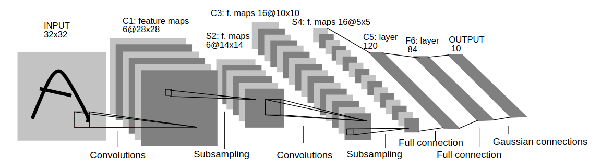
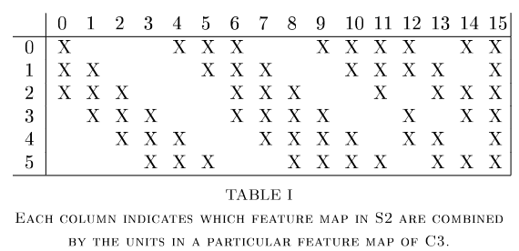

# Text classification using LenNet-5 and the MNIST dataset

LeNet-5 is a well-known, relatively old and commonly used application of machine learning for teaching. More specifically, the architeture is called a Convolutional Neural Network (CNN), which can be used to classify images. Any labeled images can be used; however, the original paper used a set of hadwritten digits and produced an output of 10 values, each representing the likliehood that the image represented a given digit: 0-9.

Below is LeNet-5's Architecture as shown in the manuscript. Don't worry about understanding it all immediately -- it'll have a PyTorch implementation shortly. Focus on that the input is a 32x32 pixel image and the output is a 10 values (aka a 1x10 matrix)



## LeNet-5 and MNIST
The LeNet-5 neural network architecture was published in 1998. It is also featured as the example neural network for PyTorch's ["Introduction to PyTorch" video](https://youtu.be/IC0_FRiX-sw). A TensorFlow 2.0 implementation example is [here](https://towardsdatascience.com/understanding-and-implementing-lenet-5-cnn-architecture-deep-learning-a2d531ebc342). More links to various articles and videos feature LeNet-5 are at the end of this write-up.

MNIST is a dataset of handwritten digits that is hosted by the National Institute of Standards and Technology. This is a great, freely available dataset that can be used to replicate training a classifier similar to the original LenNet-5 manuscript.

## PyTorch Example Code

This example is done using PyTorch.

### Loading MNIST Images and Labels

MNIST is a dataset that is readily available in PyTorch. This makes it straight-forward create a `DataLoader` with the
training and test images.

```
import torch
import torchvision
import torchvision.transforms as transforms
import torch.nn as nn
import torch.optim as optim

# Define the transformation to be applied to the data
transform = transforms.Compose(
    [transforms.ToTensor(),
     transforms.Normalize((0.5,), (0.5,))])

# Auto-download and load the training set
trainset = torchvision.datasets.MNIST(
    root='./data', train=True, download=True, transform=transform)
trainloader = torch.utils.data.DataLoader(
    trainset, batch_size=64, shuffle=True, num_workers=2)

# Auto-download and load the test set.
testset = torchvision.datasets.MNIST(
    root='./data', train=False, download=True, transform=transform)
testloader = torch.utils.data.DataLoader(
    testset, batch_size=64, shuffle=False, num_workers=2)
```

### LeNet-5 Architecture
Matching the LeNet-5 architecture in PyTorch is simplified by using `Conv2d` to perform the convolution, `AvgPool2d` to
do the sampling and `Linear` to add the final network layers. This isn't an exact match to the original mauscript;
however, the rest of the write-up will still refer to the model as "LeNet-5". Let's start with the manuscripts image
and some approxiate code.


```
# Define a neural network to match LeNet-5's architecture from the manuscript
class LeNet5(nn.Module):
    def __init__(self):
        super(LeNet5, self).__init__()
        self.conv1 = nn.Conv2d(1, 6, kernel_size=5)  # Approximate C1 feature maps
        self.pool1 = nn.AvgPool2d(kernel_size=2, divisor_override=1)  # Subsample by 2x2 regions to make 6 16x16 maps
        self.conv2 = nn.Conv2d(6, 16, kernel_size=5)  # Approximate C3 feature maps
        self.pool2 = nn.AvgPool2d(kernel_size=2, divisor_override=1)  # Subsample by 2x2 regions to make 16 4x4 maps
        self.fc1 = nn.Linear(16 * 4 * 4, 120)   # C5 layer of 120 (fully connected)
        self.fc2 = nn.Linear(120, 84)  # F6 later of 84 (fully connected)
        self.fc3 = nn.Linear(84, 10)  # Output (supposed to be Gaussian connections)

    def forward(self, x):
        x = torch.relu(self.conv1(x))
        x = self.pool1(x)
        x = torch.relu(self.conv2(x))
        x = self.pool2(x)
        x = x.view(-1, 16 * 4 * 4)
        x = torch.relu(self.fc1(x))
        x = torch.relu(self.fc2(x))
        x = self.fc3(x)
        return x
```

The rough shape of LeNet-5 is in the above example but lots of details from the original manuscript were lost in the
interest of keeping this write-up relatively simple.

* "Layer C1 is a convolutional layer with 6 feature maps. Each unit in each feature map is connected to a 5x5 neighborhood in the input."
   * The example uses a Conv2d with the right kernel size
* "Layer S2 is a sub-sampling layer with 6 feature maps ofsize 14x14. Each unit in each feature map is connected to a 2x2 neighborhood in the corresponding feature map in C1. The four inputs to a unit in S2 are added [...]"
   * The example takes the max value using `AvgPool2d` with `divisor_override=1` to use the sum and match the
      manuscript. `MaxPool2d` would likely be a decent approximation too.
* C3 deviates notably. "Layer C3 is a convolutional layer with 16 feature maps. Each unit in each feature map is
  connected to several 5x5 neighborhoods at identical lo cations in a subset of S2's feature maps. Table I shows the
  set of S2 feature maps combined by each C3 feature map."
   * This example simply doesn't do this custom mapping. It does a full convolution, which the manuscript reasons is
      not as desirable; however, it is left as-is here for simplicity. It'll still work.




* "Layer S4 is a sub-sampling layer with 16 feature maps of size 5x5. Each unit in each feature map is connected to a
   2x2 neighborhood in the corresp onding feature map in C3, in a similar way as C1 and S2.
   * This layer matches the expected logic. See the description for S2. Same tactic used here.
* C5, F6 and OUTPUT are all similar, full, linear connections and match the manuscript. The notable difference is in F6 to
  OUTPUT where a described Euclidean Radial Basis Function (RBF) and gaussian distribution to calculate likliehoods for
  each for the 10 output classes (i.e. digits 0-9). This example isn't doing the RBF. It is letting PyTorch calculate
  logits and using those.

### Training the LenNet-5 Model

We can run the network by instantiating `LeNet5` and enumerating through the data. The manuscript differs from below
in that it uses Mean Square Error (MSE) for loss versus the cross entropy loss used below. The manuscript also
has a more elaborate set of training passes: 20 iterations with various learning rates (2x 0.0005, 3x 0.0002, 3x 0.0001,
4x 0.00005, 8x 0.00001).

Below does a few passes through the data using a more aggressive loss function, cross entropy. The end result is likely
not as fine tuned as LeNet-5; however, it is simpler code, faster and should still work relatively well.

```
net = LeNet5()

# Define the loss function and optimizer
criterion = nn.CrossEntropyLoss()
optimizer = optim.SGD(net.parameters(), lr=0.001, momentum=0.9)

# Train the model
num_epochs = 2
for epoch in range(num_epochs):
    running_loss = 0.0
    for i, data in enumerate(trainloader, 0):
        inputs, labels = data
        optimizer.zero_grad()
        outputs = net(inputs)
        loss = criterion(outputs, labels)
        loss.backward()
        optimizer.step()
        running_loss += loss.item()
        if i % 100 == 99:
            print('[%d, %5d] loss: %.3f' %
                  (epoch + 1, i + 1, running_loss / 100))
            running_loss = 0.0

print('Finished Training')
```

Overall runtime on is fast -- less than a minute. You can see the calcualted loss decrease with each training iteration.

```
WIP: copy the example
```

# Results

Finally, we can test the resulting accuracy and pull out some examples of cases that classified correctly and that didn't.

```
# Calculating how accurate the model performs
from torchvision.transforms.functional import to_pil_image
from PIL import Image
with torch.no_grad():
    correct = 0
    total = 0
    wrong_prediction_count = 0
    for images, labels in testloader:
        outputs = net(images)

        # Show the inaccurate predictions
        for i, output in enumerate(outputs):
            prediction = (output.max() == output).nonzero(as_tuple=True)[0].item()
            if prediction != labels[i]:
                if wrong_prediction_count < 10:
                    wrong_prediction_count += 1
                    image_index = total + i
                    print(f'{image_index} mismatch. Predicted {prediction} but it was labeled {labels[i]}')
                    image = to_pil_image(images[i])
                    image.save(f'incorrect_{image_index}_label_{labels[i]}_predicted_{prediction}.png')

        # Calculate correct images
        _, predicted = torch.max(outputs.data, 1)
        total += labels.size(0)
        correct += (predicted == labels).sum().item()

    print(f'Test Accuracy of the model on the {len(testset)} test images: {100 * correct / total:.2f}% ({correct} correct, {len(testset) - correct} incorrect')
```

93.77% seems pretty good given that this was a quick code example based on the manuscript's description!

```
Test Accuracy of the model on the 10000 test images: 93.77% (9377 correct, 623 incorrect
```


## More links

There are many more resources related to LeNet-5. Many are repeats of the same concept or implementations in different languages or trained with different data sets.  This section enumerates the links, grouping by related implementation and sorted roughly by the order I'd suggest reading them.

*Manuscripts and DataSets*

* ["Gradient-based learning applied to document recognition" by Y. Lecun et al, 1988](https://ieeexplore.ieee.org/document/726791) (note [Stanford hosts a copy of the PDF](http://vision.stanford.edu/cs598_spring07/papers/Lecun98.pdf))
* [MNIST](http://yann.lecun.com/exdb/mnist/) and [MNIST wiki article](https://en.wikipedia.org/wiki/MNIST_database)
  * See [Kaggle's copy of the original MNIST data](https://www.kaggle.com/datasets/hojjatk/mnist-dataset/data)
  * [EMNIST](https://www.nist.gov/itl/products-and-services/emnist-dataset) was published in 2017

*PyTorch*

* ["Introduction to PyTorch" video](https://youtu.be/IC0_FRiX-sw)

*TensorFlow*

* [LenNet-5 A Classic CNN Architecture](https://www.datasciencecentral.com/lenet-5-a-classic-cnn-architecture/)
* [Understanding and Implementing LeNet-5 CNN Architecture](https://towardsdatascience.com/understanding-and-implementing-lenet-5-cnn-architecture-deep-learning-a2d531ebc342)

*Others*

* [Kaggle MNIST Dataset](https://www.kaggle.com/datasets/hojjatk/mnist-dataset/data) copy and link to code that uses it
