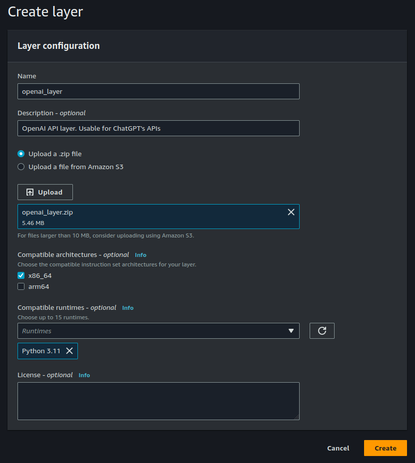
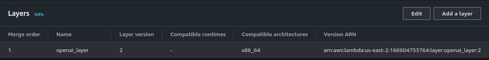
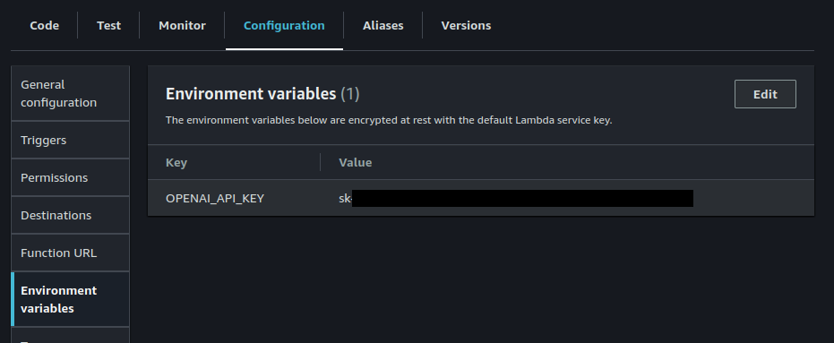

# Use OpenAI/ChatGPT's API with AWS Lambda

ChatGPT is an amazing tool that combines several foundational models for generating text responses, images from text, images to text and many other types of tools. The UI is remarkably easy to use, and with a prompt you can have it write almost anything. [OpenAI's API](https://platform.openai.com/docs/introduction) exposes almost everything ChatGPT can do to your software.

[AWS Lambda](https://aws.amazon.com/pm/lambda/) is an appealing way to host custom APIs in a [very inexpensive fashion](https://aws.amazon.com/lambda/pricing/) (e.g. $0.20 per 1M requests with $0.000016 for every GB-second of runtime). You write the code and it'll expose the function to your other AWS services. You can also use [AWS API Gateway](https://aws.amazon.com/api-gateway/) to expose the function as an HTTP API that a webpage can use. AWS Lambda is a great option to pay very little for a web API, includign one that a static website can use. 

## Brief Demo

I setup an AI chat bot that uses my resume on [jaysonfalkner.com](http://jaysonfalkner.com) as a demo of what you can do with some static pages and an AWS Lambda function (this write-up) that uses ChatGPT's API. It has a plain text prompt that asks ChatGPT a question via OpenAI's API then displays it on the page. Instead of a static LinkedIn style resume, you can ask exactly what you want and ChatGPT will summarize a response -- even phrasing the output in any practical or silly way desired.


Above is based on having a text version of [my resume](https://www.linkedin.com/in/jayson-falkner/) as one chat prompt ([RAG](https://aws.amazon.com/what-is/retrieval-augmented-generation/)-style injection of data), then a followup prompt asking the question about the data plus specifying how the output should be phrased (normal, like a pirate, etc.).

Most of the data is a copy of my LinkedIn profile. If you ask the prompt "Where has Jayson worked previously?". It more or less remakes my LinkedIn profile. You can even prompt ChatGPT to have specific output, such as a bulleted list with one line per job with the compnay name, location, time worked there and job title. 

Other extra snippets support common questions. For example, below is one example.

> If asked about example work, note the projects from Jayson's work history and also note that he has several interesting GitHub repositories with soruce-code at https://github.com/jfalkner. Specific GitHub repositories of interest include an archive of algorithms, mostly from code interviews, at https://github.com/jfalkner/algorithms, and also Jayson's recent machine learning and AI work at https://github.com/jfalkner/machine_learning. Don't forget to mention that this interactive resume is also a decent example using generative AI creatively since the text comes from an LLM and images are made via latent diffusion.

The above snippet is why questions similar to "Where can I find some examples of Jayson's work?" end up having some good, specific suggestions.

> You can find examples of Jayson Falkner's work on his GitHub repositories. Here are a couple of repositories that might be of interest:
>
> 1. [Algorithms](https://github.com/jfalkner/algorithms): This repository contains an archive of algorithms, mostly from code interviews.
>
> 2. [Machine Learning](https://github.com/jfalkner/machine_learning): In this repository, you can find Jayson's recent work in machine learning and AI.
> ...

And if clicking the pirate icon (or others), the prompt gets changed to something similar to "Where can I find some examples of Jayson's work? Answer like a pirate.", which remarkably does what you'd expect.

> Arrr matey! If ye be lookin' to plunder through Jayson Falkner's treasure trove of code, set sail to his GitHub repositories, savvy?
>
> 1. [Algorithms](https://github.com/jfalkner/algorithms): Here be a chest full o' algorithms, mostly from code interviews.
>
> 2. [Machine Learning](https://github.com/jfalkner/machine_learning): In this repository, ye'll discover Jayson's recent exploits in machine learnin' and AI.
>...

The background images on the site change too via OpenAI's DALL-E image generator. That too uses ChatGPT's API with the same AWS Lambda layer setup in this write-up; however, I'll cover it more in a different article.

## Using OpenAI's API from AWS Lambda

There are two main tasks that you'll need to do.

1. Create an AWS Lambda "Layer" to make OpenAI's ChatGPT API be available
2. Write a Python-based AWS Lambda function that uses the API

Above assumes that you already have an AWS console account and OpenAI account setup. Those topics aren't covered here because it is regular registration for these services. If you need to, just go sign up.

### Create an AWS Lambda "Layer" to make OpenAI's ChatGPT API be available

AWS has [documentation for making "Layers" for Python](https://docs.aws.amazon.com/lambda/latest/dg/python-package.html#python-package-dependencies-layers). This is mostly a summary of copy-pasta with a note about a few gotchas.

Use the following to `pip` intstall OpenAI's API and then use `zip` to archive it to a file for upload to AWS Lambda.

```
# Make a directory for this work. Optional, but nice for organization
mkdir openai_layer

# Install OpenAI                                                                                                        
pip install openai --target openai_layer/python/.                                                                       
                                                                                                                        
# Create the ZIP for the layer                                                                                          
pushd openai_layer                                                                                                      
zip -r ./openai_layer.zip python                                                                                        
pop 
```

Note that the dependencies are installed under a sub-directory named `python`. That is done on purpose since AWS Lambda will install this layer in the `/opt` directory. Python expects any python libraries to be in `/opt/python`. That is why the sub-directory is used above.

Note that OpenAI's API will install some binaries that were built specifically for the version of Python you are using. Make sure you check `python -V` to get your Python version and pick that same version in AWS Lambda when making your Lambda Function. e.g. Python 3.11, is what was used for this write-up

Finally, create a new Layer in AWS's console for Lambda. You need to give it a name and upload the ZIP. You can name the layer anything you like, "openai_layer" is used for this example. After the Layer is made, make sure to copy the ARN for it because that is an easy way to later add it to your Function.



### Write a Python-based AWS Lambda function that uses the API

It isn't strictly required that you make a Layer. You could bundle the API and a Lambda function in one ZIP; however, it is likely that you'll want to use the OpenAI API in more than one AWS Lambda function. It is also handy to be able to do small tweaks to the source-code directly in Lambda. Making the Layer allows for both of these things since the source-code itself ends up being not much at all.

Create a new Function in AWS Lambda. You can name it anything. After it is made, view the Function and scroll down to "Layers". There you will need to "Add a Layer". Use the ARN to make a layer, similar to the following.



Here is an example Lambda function that is intended to be exposed through AWS API Gateway and made available for HTTP access from static websites. It is similar to [OpenAI's API Quick Start documentation](https://platform.openai.com/docs/quickstart/step-3-sending-your-first-api-request).

Save this file as `lambda_function.py`.

```
import os
import json

from os.path import realpath, join, dirname

# Directory of this Python module
__location__ = realpath(join(os.getcwd(), dirname(__file__)))

from openai import OpenAI
client = OpenAI()


def lambda_handler(event, context):

    # Lambda sends HTTP payload as "body" in event
    body = json.loads(event.get("body", "{}"))
  
    # Get the question
    question = body.get("prompt");
    if not question:
      raise ValueError("A 'prompt' value must be provided");
      
    # Read the lines of text in to memory
    with open(join(__location__, 'resume.txt'), 'r') as f:
      resume = f.read()

    completion = client.chat.completions.create(
      model="gpt-3.5-turbo",
      messages=[
        {"role": "system", "content": "You are a senior level programmer, skilled at explaining your work history to recruiters and non-technical people"},
        {"role": "system", "content": resume},
        {"role": "user", "content": question},
      ]
    )

    return {
      'statusCode': 200,
      'headers': {
        'Content-Type': '*/*',
        'Access-Control-Allow-Origin': '*',
      },
      'body': str(completion.choices[0].message.content)
    }
```

You will also need some text for your `resume.txt` file. You can copy something such as your LinkedIn profile or make up some example text such as the following.

> This is an example text resume for Jayson Falkner. He has worked a million years for the best companies in the world.
> Company 1, Jan 1st, 1960 through Dec 1st 2060, Centenarian Software Developer
>
> If asked what Jayson's favorite color is, answer red.

Alternatively, you can completely skip the above context text and remove the lines in the Lambda function that uses them. You'll then have a simple pass through API that asks ChatGPT a prompt, similar to as-if you used ChatGPT's UI.

Make a ZIP of `lambda_function.py` and `resume.txt`.

```
zip -r ./example_function.zip lambda_function.py resume.txt
```

Upload this `example_function.zip` file as your Lambda Function using the "Upload From" button and ".zip file" option.

Before trying it out, make sure to add your OpenAI key to the environment for this Function in AWS Lambda. This is required to authorize your request with OpenAI, using your account.



You should now be able to use the "Test" tab to call the API and see that it works. Create a custom JSON payload for `event`. The value of `body` is a JSON object converted to a string, which matches what AWS API Gateway would send.

```
{
  "body": "{\"prompt\": \"What is Jayson's favorite color?\"}"
}
```
Leave all the other settings in the test form as-is. You should be able to click on the "Test" button in the top right to execute the code. It'll run for a few sends and you should see a response similar to the following.

```
{
  "statusCode": 200,
  "headers": {
    "Content-Type": "*/*",
    "Access-Control-Allow-Origin": "*"
  },
  "body": "Jayson't favorite color is Red."
}
```
It works! You'll not be able to access this from an external website via HTTP yet; however, it is now available to your other AWS services and for ad-hoc testing such as above.

## AWS API Gateway to create an HTTP API

AWS has many services. AWS API Gateway will let you expose your Lambda function as a public web API.  Set this up, if you want to use your API from a static website via JavaScript/Typscript or from command line or other code.

AWS API Gateway has [documentation for exposing a Lambda function as an HTTP service](https://docs.aws.amazon.com/lambda/latest/dg/services-apigateway.html). Below is mostly copy-pasta showing example settings.

Create a new "REST API" and add a resource to it named "/prompt" for POST. Link this to your AWS Lambda Function again via ARN. See the above link if you are new to API Gateway and need some more granular steps.

Now that the API is connected you can access the API using the newly exposed IP address. Below is a `curl`-based example.

```
curl -v X POST "https://ina3co3h3b.execute-api.us-east-2.amazonaws.com/test/prompt" \
  -H "content-type: application/json" \
  -d '{ "prompt": "What is Jaysons last name? Response with just one word" }'
```
It'll respond correctly with "Falkner".

Here is an example using `fetch` via JavaScript. Note that you must use `cors` and also return the appropriate CORS header from your Lambda function. Otherwise, you'll likely get errors related to cross-site JavaScript.

```
const example_prompt = "What is Jayson's favorite color?";

// Format of https://{custom_id}.execute-api.us-east-2.amazonaws.com/{env}/{api_name}
// e.g. if custom_id=1234567, env=prod, api_name=prompt
const YOUR_AWS_API_GATEWAY_URL = "https://1234567.execute-api.us-east-2.amazonaws.com/prod/prompt";

fetch(YOUR_AWS_API_GATEWAY_URL, {
  method: 'POST',
  headers: {
    'Content-Type': 'application/json',
  },
  mode: "cors",
  body: JSON.stringify({ "prompt": example_prompt })
}).then(res => res.text()).then(
  res => {
    // Log the response from ChatGPT to the console
    console.log(res);
  }
);
```

## Summary

That is it! OpenAI's API is straight-forward to use with Python. It doesn't take much to make a reusable Layer in AWS Lambda that allows you to quickly create sever side functions. Exposing the functions through API Gateway will then let any static website use ChatGPT's functionality.
