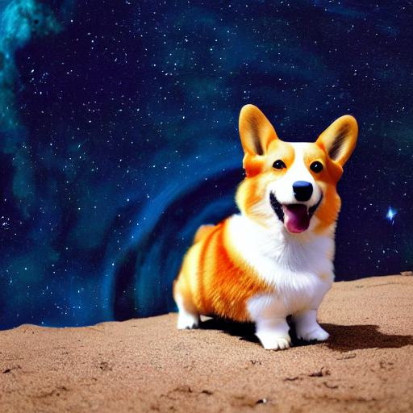
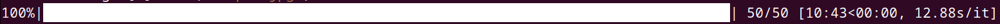
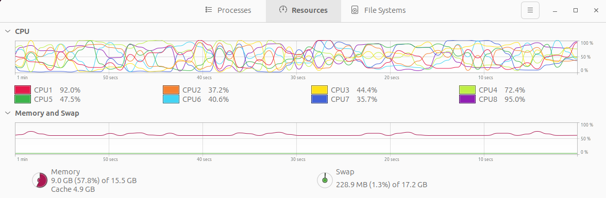
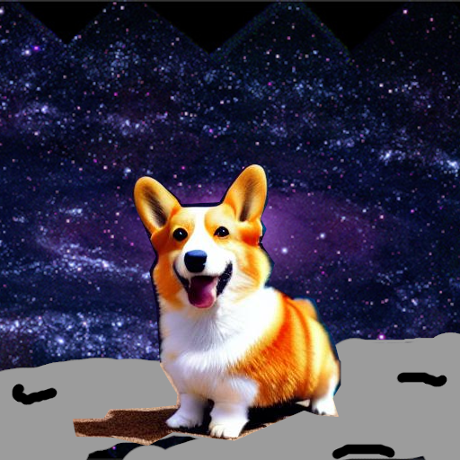
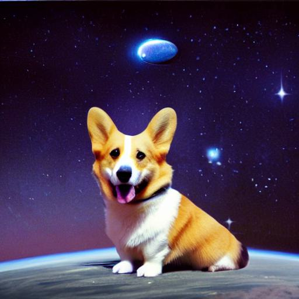

# Stable Diffusion using CPU (doing it the slow way!)

Stable Diffusion is really cool and you can run it on your computer, if you have a GPU with at least 10GB of VRAM. That is a lot. It is VRAM too, not RAM. Most of us don't have a high-end NVIDIA graphics card. It would also be fun to be able to at least play around with stable diffusion on your laptop.

This example is how to run Stable Diffusion without a needing the VRAM. The trade-off is time. You'll find it is possible but takes minutes to make an image that would only take a few seconds using a nice NVIDIA. CUDA is an amazing tool. I'd agree that you can easily find other ways to quickly generate stable diffusion-based images via websites that run things on the backend for you, or similar latent diffusion models via Bing Chat/DALL-E or Google's Gemini. This isn't a solution for most practical uses. It is an example for learning and hacking.

## Recreating Stable Diffusion using PyTorch
Stable diffusion is described by a paper that shows what neural networks are used and what input sources are required. Along with the paper, several pre-trained models are provided, which are the main thing you need. You can use PyTorch to recreate the same network as the paper describes, load the pre-trained model then run PyTorch with just the CPU -- no requirement for VRAM.

Let's use [kjsman/stable-diffusion-pytorch](https://github.com/kjsman/stable-diffusion-pytorch) as an excellent "Yet another PyTorch implementation of Stable Diffusion". You need to do a few steps.

*Download the repository and setup PyTorch and dependencies*
Follow the repo's instructions as they may be updated. For this example, it was as straight-forward as the following.
```
# Download the repository using git
git clone https://github.com/kjsman/stable-diffusion-pytorch.git

# Setup the dependencies (in the repo's directory)
cd stable-diffusion-pytorch
pip install torch numpy Pillow regex
```

*Download the pre-trained model*
This repo conveniently has the pre-trained model shared via Hugging Face [here](https://huggingface.co/jinseokim/stable-diffusion-pytorch-data/resolve/main/data.v20221029.tar). Note, that it is using a checkpoint of Stable Diffusion, which has licensed with [CreativeML Open RAIL-M License](https://huggingface.co/spaces/CompVis/stable-diffusion-license) that you need to read too.

Setup of the model is simple. Extract the files from the tar in the repo's directory.

```
# Extract with tar (Linux/Mac example)
tar -xf ~/Downloads/data.v20221029.tar
```

You'll now have a `data` subdirectory with a bunch of files, including a `ckpt` subdirectory. Note, you'll also have some other existing directories from the repository itself. For example, `stable_diffusion_pytorch`.

## Running Stable Diffusion via PyTorch

You can now run stable diffusion. Make sure you have a good amount of RAM available. For example, this was tested on a [Steamdeck](https://en.wikipedia.org/wiki/Steam_Deck) running Ubuntu linux via SD card (i.e. no dedicated GPU, AMD Zen 2 w/ 4-cores/8-threads @ 2.4–3.5 GHz and 16GB RAM). In other words, running on something smaller than a toaster.

```
from stable_diffusion_pytorch import pipeline

prompts = ["a photograph of a corgi in outter space, futuristic, cosmic, award winning photo"]
images = pipeline.generate(prompts)
images[0].save('output.jpg')
```



It took almost 10 minutes to generate this image; however, it definitely worked!



RAM usage wasn't crazy. It'd spike around 10GB, including random stuff and a web browser running in the background. CPU usage was not pegged either. It is likely possible to optimize CPU usage to speed up image generation; however, it'll never be nearly as fast as having a nice GPU (a few seconds using an NVIDA 4080 or ~20 seconds using a 3080).



### Creating images from examples
You can also use all the other Stable Diffusion tricks such as seeding with an existing image and having the algorithm refine it. The `strength` parameter helps roughly guide what percent of the original photo is kept.

Here is an example of the corgi from above poorly cut from the image, flipped to face the other direction, pasted on a [NASA pic of Andromeda](https://svs.gsfc.nasa.gov/10485), and with a grayish planet poorly painted in for the corgi to stand on.



Run stable diffusion with this image as the seed and 80% for the strength. Note that the image is 512x512 pixels, loaded with PIL and has the alpha channel stripped since the input needs to be just RGB.

```
# Load the image, ensure just RGB
input_images = [Image.open('corgi_in_space_seed_80.png').convert('RGB')]

prompts = ["a photograph of a corgi in outter space, futuristic, cosmic, award winning photo"]

# Generate an image using `strength=0.8`
images = pipeline.generate(prompts, input_images=input_images, strength=0.8)

images[0].save('output.jpg')
```



